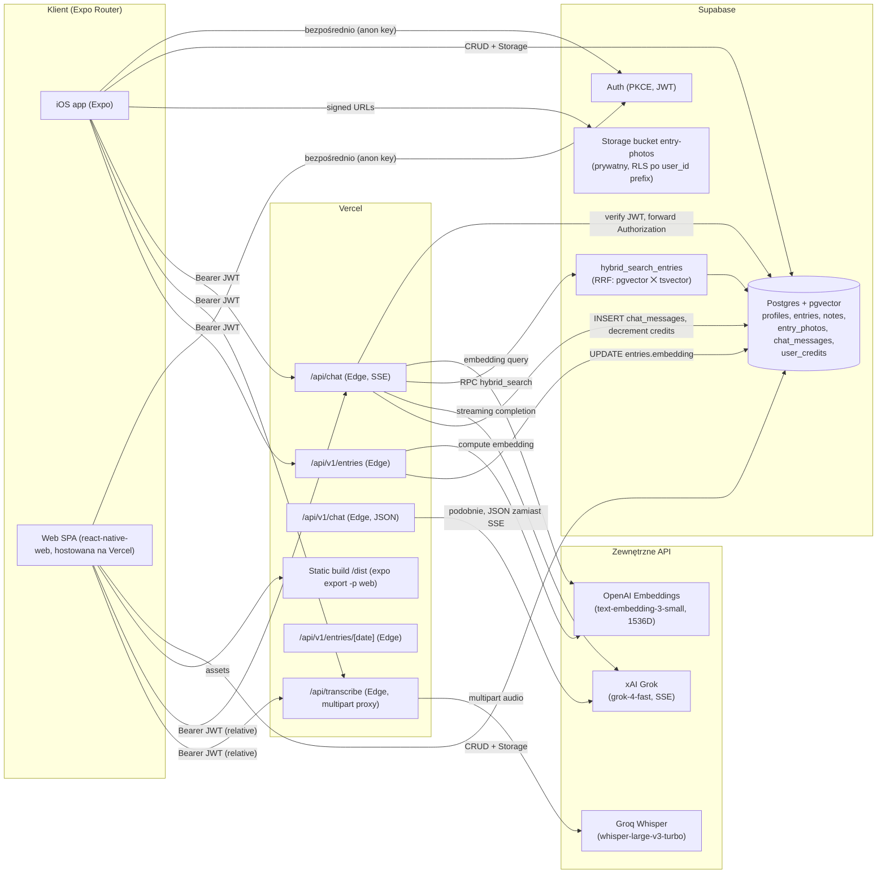

# Architektura — Daily Bloom

> Dokument opisuje stan systemu znaleziony w repozytorium na dzień 2026-06-16. Elementy nie poparte plikami w repo oznaczone są jako `[do weryfikacji]`. Nie zawiera żadnych wartości sekretów — wyłącznie nazwy zmiennych środowiskowych i ich rola.

## 1. Przegląd systemu

**Daily Bloom** to mobilno-webowa aplikacja-dzienniczek (Expo + React Native Web → jeden kodebase na iOS i web). Codzienny krótki kwestionariusz (6 osi 1–5 + 2 tagi) generuje deterministyczny "kwiatek dnia" renderowany w Skia. Notatki tekstowe + dyktando głosowe + zdjęcia per notatka uzupełniają wpis. Asystent AI (xAI Grok) odpowiada na pytania, korzystając z hybrydowego wyszukiwania (pgvector + tsvector) po historycznych wpisach.

Klient mówi do dwóch backendów:
- **Supabase** (Postgres + pgvector + Storage + Auth) — źródło prawdy dla wszystkich danych użytkownika.
- **Vercel Edge Functions** (`/api/*`) — wąski proxy/orchestrator dla operacji wymagających sekretu serwerowego (xAI, OpenAI embeddings, Groq Whisper) lub łączenia wyszukiwania semantycznego z LLM.

Front i backend są w jednym repo; web jest wypychany na Vercel (statyczny build z `expo export -p web` + edge funkcje z `/api`), natywny build idzie przez Expo / EAS `[do weryfikacji — brak konfigu EAS w repo]`.

## 2. Diagram architektury



## 3. Komponenty

### 3.1 Klient (Expo / Expo Router)

- **Stack:** Expo 56, React 19.2, React Native 0.85, expo-router 56, TypeScript 6, NativeWind 4 (Tailwind), `@shopify/react-native-skia` 2.6 (render kwiatka), react-native-reanimated 4, zustand 5 (store).
- **Routing:** `src/app/` — file-based.
  - `_layout.tsx` — AuthGate (redirect do `/auth` / `/onboarding` / `/index` zależnie od stanu profilu).
  - `auth.tsx` — login (Supabase Auth).
  - `onboarding.tsx` — wybór imienia + flower seed.
  - `index.tsx` — home (kwiatek dnia, lista wpisów).
  - `entry.tsx` — kwestionariusz dnia → notatka.
  - `note.tsx` — composer pojedynczej notatki + zdjęcia + dyktando.
  - `chat.tsx` — chat z agentem.
  - `docs.tsx` — publiczna strona z dokumentacją API (`/api/v1/*`).
  - `lab.tsx` — wewnętrzny playground (kwiatek).
- **Komponenty:** `src/components/` — `Flower*`, `NoteCard`, `note/AttachPhotosButton`, `note/EntryPhotosStrip`, `chat/*`, `ui/*` (shadcn-style primitives).
- **Lib:**
  - `src/lib/supabase.ts` — klient Supabase (PKCE, AsyncStorage, `detectSessionInUrl` tylko na web).
  - `src/lib/store.ts` — zustand store: `notesByDate`, `photosByNoteId`, akcje (`addNote`, `addPhoto`, `removePhoto`, `deleteNote`, `hydrate`, …).
  - `src/lib/db/{entries,notes,photos,profile,chat,types}.ts` — repozytoria Supabase.
  - `src/lib/chat/useChat.ts` — hook do `/api/chat` (SSE → plain text), z `EXPO_PUBLIC_API_BASE` (relatywne na web, absolutne na natywne).
  - `src/lib/dictation/{transcribe,useDictation}.ts` — dyktando przez `/api/transcribe`.
  - `src/lib/flower/{dna,organic,petals,palettes,color,types}.ts` — deterministyczny DNA kwiatka z `user_id` + dane wpisu → render Skia.
  - `src/lib/week.ts`, `src/lib/utils.ts`, `src/lib/questions.ts`.

### 3.2 Vercel Edge Functions (`api/`)

Wszystkie `runtime: 'edge'`. Każdy endpoint wymaga `Authorization: Bearer <supabase JWT>` (poza tymi gdzie nie ma user-specific danych — `[do weryfikacji]`). Helper `api/_lib/auth.ts#requireUser` tworzy klient Supabase z **forwardowanym nagłówkiem Authorization**, dzięki czemu RLS po `auth.uid()` działa identycznie jak z klienta.

| Endpoint | Tryb | Zewnętrzne | Co robi |
|---|---|---|---|
| `POST /api/chat` | SSE → plain text | xAI, OpenAI embeddings | streamuje odpowiedź Grok-4-fast, dokleja kontekst (hybrid search + ostatnie 7 dni), zapisuje user+assistant do `chat_messages`, dekrementuje `user_credits.credit_cents`. |
| `POST /api/v1/chat` | JSON (sync) | xAI, OpenAI embeddings | wariant dla agentów (Mac/CLI itp.), bez streamu. |
| `POST /api/v1/entries` | JSON | OpenAI embeddings | upsert wpisu po `(user_id, date)`, walidacja osi 1–5, przelicza embedding + `embedding_source`. |
| `GET /api/v1/entries/[date]` | JSON | — | zwraca wpis + notatki dla danej daty. |
| `POST /api/transcribe` | multipart proxy | Groq Whisper | proxy audio (max 25 MB) do Whisper-large-v3-turbo, `language=pl`. |

Shared:
- `api/_lib/chat-shared.ts` — stała `MODEL = 'grok-4-fast'`, pricing, `buildSystemPrompt` (7-dniowa retrospektywa + relevant context z hybrid search), wrapper `hybrid_search_entries` (RPC, embedding serializowany jako literał `[v1,v2,…]`).
- `api/_lib/embedding.ts` — wrapper na OpenAI `text-embedding-3-small` (1536D), LRU cache (max 100 wpisów), funkcja `buildEmbeddingSource` musi zostawać zgodna z `scripts/seed-history.ts`.
- `api/_lib/auth.ts` — `requireUser(req)` → `{ user, supabase }`.

### 3.3 Supabase (Postgres + Storage + Auth)

**Auth:** standardowy Supabase Auth, PKCE flow, sesja w AsyncStorage. `[do weryfikacji — czy włączone OAuth providery]`. Demo login: `demo@dailybloom.local`.

**Tabele (z migracji + `src/lib/db/types.ts`):**
- `profiles` — `user_id`, `name`, `flower_seed`.
- `entries` — wpis dzienny, oś 1–5, `embedding vector(1536)`, `embedding_source text`, `search_tsv tsvector` (generowane), unikalne `(user_id, date)`.
- `notes` — N notatek per dzień, `text` może być pusty (constraint `notes_text_check` zdjęty migracją `20260612180000_notes_allow_empty_text.sql` — notatka istnieje też jako kontener na zdjęcia).
- `entry_photos` — zdjęcia per notatka. `note_id uuid NOT NULL` z `ON DELETE CASCADE` do `notes(id)` (migracja `20260612170000_photos_per_note.sql`). `storage_path`, `order_index`, `width`, `height`, `date` (zachowane dla batch fetch).
- `chat_messages` — `role`, `content`, `tokens_in`, `tokens_out`.
- `user_credits` — `credit_cents` `[do weryfikacji — brak osobnej migracji w repo, prawdopodobnie dodana wcześniej / poza repo]`.

**Indeksy:**
- `entries.embedding` — HNSW (pgvector).
- `entries.search_tsv` — GIN.
- `entry_photos (note_id, order_index)`.

**RPC `hybrid_search_entries`** — RRF (k=60) z pgvector cosine + tsvector rank.

**Storage:**
- Bucket `entry-photos`, prywatny, limit 10 MB, allow `image/jpeg|png|webp|heic|heif`.
- Ścieżki: `<user_id>/<dateIso>/<note_id>/<token>.<ext>`.
- RLS po `storage.foldername(name)[1] = auth.uid()::text` (pierwszy segment ścieżki = user).
- Klient pobiera signed URLs (`createSignedUrls`, TTL 1h).

**RLS:** wszystkie tabele user-scoped, polityki po `auth.uid() = user_id`.

### 3.4 Zewnętrzne API

| Serwis | Model / endpoint | Cel | Sekret |
|---|---|---|---|
| xAI | `grok-4-fast`, OpenAI-compatible chat completions (SSE) | streamingowa odpowiedź chatu | `XAI_API_KEY` (server-side) |
| OpenAI | `text-embedding-3-small`, 1536D | embedding wpisu + zapytania chat | `OPENAI_API_KEY` `[do weryfikacji — brak w .env.example, ale używane w api/_lib/embedding.ts]` |
| Groq | `whisper-large-v3-turbo`, multipart `audio/transcriptions`, `language=pl` | dyktando głosowe | `GROQ_API_KEY` (server-side) |
| Supabase | REST + Realtime + Storage + Auth | persystencja, auth, files | `EXPO_PUBLIC_SUPABASE_URL`, `EXPO_PUBLIC_SUPABASE_ANON_KEY` (public) |

## 4. Źródła danych

- **Postgres (Supabase managed)** — pełna persystencja: profile, wpisy dzienne, notatki, zdjęcia (metadane), historia chatu, kredyty użytkownika.
- **pgvector kolumna `entries.embedding`** — embeddingi OpenAI 1536D, indeks HNSW; źródło: `buildEmbeddingSource(entry, notes)` (musi być identyczne w `api/_lib/embedding.ts` i `scripts/seed-history.ts`).
- **tsvector `entries.search_tsv`** — generated column z tekstu wpisu/notatek; indeks GIN; używane razem z pgvector w RRF.
- **Supabase Storage `entry-photos`** — pliki binarne zdjęć (prywatny bucket).
- **AsyncStorage (klient)** — sesja Supabase (PKCE refresh token).
- **In-memory store (zustand)** — cache stanu klienta hydratowany po loginie z Supabase (`hydrate`).
- **Lokalne SQLite (`expo-sqlite`)** — zadeklarowane w `package.json` i pluginach `app.json`, ale `[do weryfikacji — w aktualnym kodzie repozytorium nie znalazłem aktywnego użycia; być może artefakt wcześniejszego "local-first MVP"]`.

Brak danych w repo: brak fixturów produkcyjnych. `scripts/seed-history.ts` to skrypt do seedowania demo.

## 5. Integracje i połączenia

### 5.1 Konfiguracja per środowisko (zmienne)

| Zmienna | Strona | Rola |
|---|---|---|
| `EXPO_PUBLIC_SUPABASE_URL` | klient + edge | base URL Supabase |
| `EXPO_PUBLIC_SUPABASE_ANON_KEY` | klient + edge | anon key (bezpieczny do ekspozycji) |
| `EXPO_PUBLIC_API_BASE` | klient | absolutny URL backendu (pusty = relative; na natywne wymagany pełny URL Vercela) |
| `XAI_API_KEY` | edge | klucz xAI Grok (server-only, bez prefiksu `EXPO_PUBLIC_`) |
| `GROQ_API_KEY` | edge | klucz Groq Whisper |
| `OPENAI_API_KEY` | edge | `[do weryfikacji — używane przez api/_lib/embedding.ts, brak w .env.example]` |
| `SUPABASE_SERVICE_ROLE_KEY` | `[do weryfikacji]` | potencjalnie potrzebny dla operacji administracyjnych / seed |

### 5.2 Auth flow

1. Klient → Supabase Auth (PKCE, email+password). Sesja w AsyncStorage; na web `detectSessionInUrl=true`.
2. Każde wywołanie edge function: klient czyta `session.access_token` z `supabase.auth.getSession()` i wysyła `Authorization: Bearer …`.
3. Edge: `requireUser(req)` tworzy klient Supabase z forwardowanym headerem → RLS po `auth.uid()` działa identycznie.

### 5.3 Dostęp Supabase → klient

Bezpośrednio (anon key + RLS). Edge dotykany tylko gdy:
- potrzebny sekret zewnętrznego API (xAI, OpenAI, Groq),
- albo łączymy wiele wywołań w jeden krok (chat: embedding → RPC → SSE → INSERT).

### 5.4 MCP / connectors

W repo nie ma plików konfiguracyjnych MCP (`.mcp.json`, `.claude/settings.json`) — `[do weryfikacji — konfiguracja MCP jest po stronie środowiska dewelopera, nie w repo]`. W bieżącej sesji deweloperskiej dostępne były m.in.: Supabase MCP (apply_migration, execute_sql, generate_typescript_types), Claude Preview, Figma — używane przez Claude Code, nie przez aplikację runtime.

## 6. Przepływ danych

### 6.1 Codzienny wpis

```
Klient (entry.tsx)
  → kwestionariusz 6 osi + 2 tagi
  → POST /api/v1/entries (lub bezpośredni upsert do Supabase + osobny call /api/v1/entries dla embeddingu)
  → Edge: walidacja, OpenAI embedding(buildEmbeddingSource), UPDATE entries (embedding, embedding_source)
  → Klient: render kwiatka (Skia, DNA z user_id + dane)
```

### 6.2 Notatka + zdjęcia

```
Klient (note.tsx, composer):
  pierwszy plusik
    → AttachPhotosButton#onBeforeUpload
    → store.addNote(today, '')                          // notatka pusta jako kontener
    → composerNoteId = note.id
  upload
    → expo-image-picker → asset
    → fetch(asset.uri).arrayBuffer()                    // ArrayBuffer, NIE Blob (RN bug)
    → supabase.storage.from('entry-photos').upload(
        `${userId}/${date}/${noteId}/${token}.${ext}`, buf)
    → INSERT entry_photos
    → createSignedUrls (TTL 1h) → cache w store.photosByNoteId
  zapisz tekst
    → store.updateNote(composerNoteId, text)
  usunięcie notatki
    → DELETE notes  → CASCADE wycina entry_photos
    → best-effort remove(bucket paths) ze store.photosByNoteId
```

### 6.3 Chat (RAG)

```
Klient (useChat.ts)
  → POST /api/chat  body: { messages, …}  Authorization: Bearer JWT
  → Edge:
     1. requireUser → supabase client z user JWT
     2. user_credits.credit_cents check (jeśli ≤ 0 → 402)
     3. OpenAI embedding(ostatnia wiadomość usera)
     4. RPC hybrid_search_entries(embedding, query_text, k=60)  → top wpisy
     5. buildSystemPrompt(profile.name, 7-day entries+notes, relevant_context)
     6. fetch xAI /v1/chat/completions stream=true
     7. SSE → parse delta → wyrzuca text chunk do klienta (plain stream)
     8. po zamknięciu: INSERT chat_messages (user) + INSERT chat_messages (assistant)
                       UPDATE user_credits decrement (na bazie pricing constants)
```

### 6.4 Dyktando

```
useDictation → expo-audio nagrywa
  → POST /api/transcribe multipart audio/m4a
  → Edge: proxy do api.groq.com/openai/v1/audio/transcriptions
          model=whisper-large-v3-turbo, language=pl
  → tekst trafia do composera (Tiptap na web / TextInput na natywne)
```

## 7. Hosting i deployment

### 7.1 Web (Vercel)

- `vercel.json`:
  - `buildCommand: "npm run vercel-build"` → `expo export -p web && cp public/canvaskit.wasm dist/canvaskit.wasm`
  - `outputDirectory: "dist"`
  - rewrites: `"/((?!api).*) → /index.html"` (SPA fallback; `/api/*` zostaje serverless).
- `/api/**/*.ts` → Vercel Edge Functions (każdy plik eksportuje handler, `export const config = { runtime: 'edge' }` w plikach `api/*.ts`).
- Vercel projekt: `[do weryfikacji — w repo brak `.vercel/`; URL prod prawdopodobnie `https://daily-bloom.vercel.app` z .env.example]`.

### 7.2 Mobilne (iOS / Android)

- Konfiguracja w `app.json` (Expo).
  - `ios.bundleIdentifier: com.kamila.dailybloom`
  - `android.package: com.kamila.dailybloom`
  - Permissions iOS: `NSMicrophoneUsageDescription`, `NSCameraUsageDescription`, `NSPhotoLibraryUsageDescription`.
  - Permissions Android: `RECORD_AUDIO`, `CAMERA`, `READ_MEDIA_IMAGES`.
  - Pluginy: `expo-router`, `expo-font`, `expo-splash-screen`, `expo-sqlite`, `expo-audio`, `expo-image-picker`.
  - `experiments.typedRoutes`, `experiments.reactCompiler`.
- Build natywny: `[do weryfikacji — brak `eas.json` w repo. Prawdopodobnie EAS Build lub local prebuild.]`
- Target App Store (iOS jako główny, web jako demo) — z `CLAUDE.md`.

### 7.3 Supabase

- Self-hosted? Managed? — managed (`*.supabase.co` URL w `.env.example` schemacie).
- Migracje wersjonowane w `supabase/migrations/`. Lokalnie aplikowane przez Supabase CLI lub przez Supabase MCP (`apply_migration`).
- Bucket `entry-photos` tworzony migracją `20260611120000_entry_photos.sql`.

### 7.4 Sekrety

- Klient: tylko `EXPO_PUBLIC_*` (Supabase URL + anon key + API base) — wbudowane w bundle.
- Edge: pełne klucze (`XAI_API_KEY`, `GROQ_API_KEY`, `OPENAI_API_KEY`) jako Vercel project env vars (server-only). Nie wchodzą do bundle klienta.

### 7.5 Środowiska

- Lokalnie: `expo start --lan` (Metro), Supabase remote, edge funkcje przez `vercel dev` lub deploy preview. `[do weryfikacji — brak skryptu w package.json dla vercel dev]`.
- Preview: każde PR → Vercel preview URL.
- Prod: gałąź `main` → Vercel prod (`[do weryfikacji — branch domyślny]`).

## 8. Otwarte pytania / TODO

1. **`OPENAI_API_KEY`** nie figuruje w `.env.example` mimo że `api/_lib/embedding.ts` go używa — uzupełnić `.env.example`.
2. **`user_credits`** — brak migracji tej tabeli w `supabase/migrations/` w repo, mimo że `api/chat.ts` jej używa. Albo dodać migrację, albo zweryfikować, czy nie istnieje tylko produkcyjnie.
3. **`expo-sqlite`** plugin jest w `app.json`, ale `[do weryfikacji — brak aktywnego użycia w `src/`]`. Jeśli nieużywany — zdjąć (zmniejsza bundle natywny).
4. **EAS / build natywny** — brak `eas.json`. Doprecyzować, jak powstaje IPA do App Store (EAS Build vs. local Xcode).
5. **`.vercel`/projekt prod** — w repo nie ma `.vercel/project.json`. Udokumentować nazwę projektu Vercela + branche.
6. **Backup / disaster recovery** — Supabase managed daje PITR `[do weryfikacji — plan]`. Nie ma skryptu eksportu danych klienta (RODO).
7. **Logowanie / observability** — brak Sentry/PostHog w `package.json`. Tylko `console.warn` w klientach. Rozważyć minimalny telemetry layer (bez PII).
8. **Limity rate-limit** na edge — brak (każdy zalogowany może spamować `/api/chat`, jedynym hamulcem jest `user_credits.credit_cents`). Dla `/api/transcribe` brak limitu po stronie aplikacji — polega na limicie Groq.
9. **CORS na `/api/v1/*`** — `[do weryfikacji — czy edge functions zwracają `Access-Control-Allow-Origin` jeśli wołane spoza Vercel domeny przez agenta zewnętrznego]`.
10. **MCP w repo** — żadna konfiguracja MCP nie jest skomitowana, mimo że development workflow mocno na nich polega. Można dodać `.mcp.json` z listą rekomendowanych serwerów (Supabase, Vercel) jako wsparcie onboardingu kolejnego dewelopera.
11. **Realtime** — Supabase realtime nie jest używany; multi-device sync polega na re-`hydrate` przy starcie. `[do weryfikacji — czy to celowe MVP-tradeoff]`.
12. **`scripts/seed-history.ts`** — utrzymać synchronizację `buildEmbeddingSource` z `api/_lib/embedding.ts` (dryf między tymi dwoma plikami spowoduje, że embeddingi seed-data nie będą porównywalne z nowymi wpisami).
